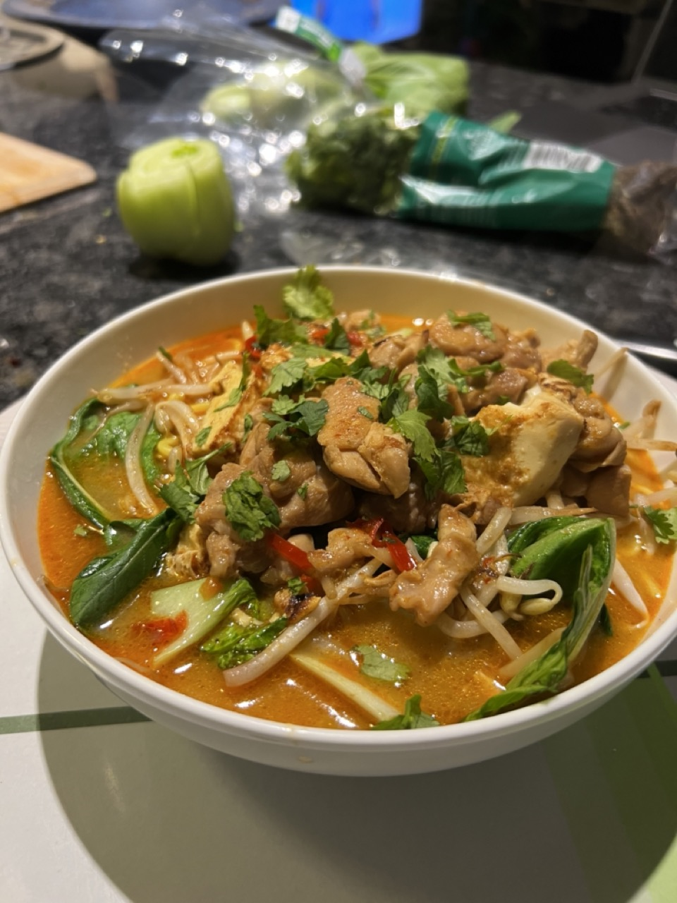
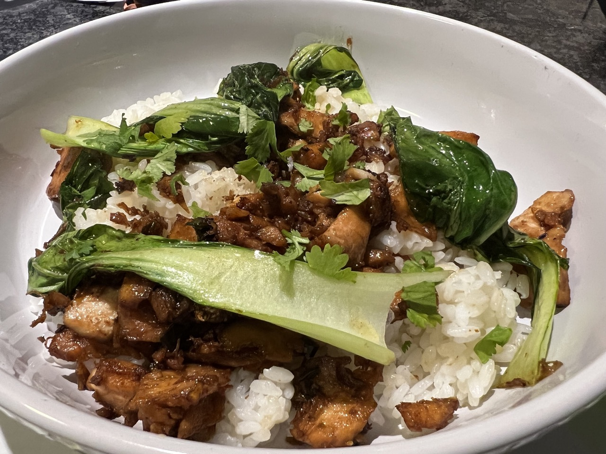
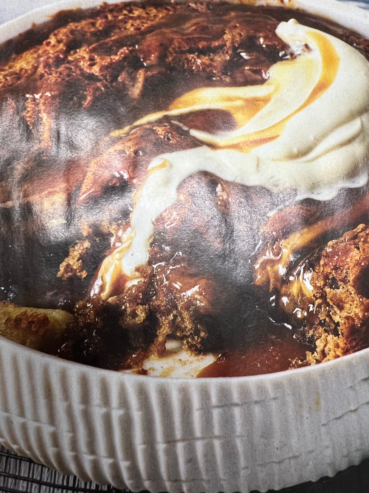

# Recipes

## Dinners

### Laksa

#### Ingredients
- 2tbsp oil
- 2tbsp Red thai curry paste
- 2tbsp Fish sauce
- 2tbsp curry powder
- 1 red chill diced
- 400ml Coconut milk
- Half a normal pack of tofu cut into chunks
- 200g diced Chicken
- 1 pack Mini bok choy
- handful of bean sprouts
- Fresh coriander
- 100ml(ish) chicken stock
- Pack of noodles

#### Method 
1. Add oil and thai curry paste to wok on high heat and stir for 1 min. Toss in chicken and stir fry for about 5 mins. 
2. Add in curry powder, fish sauce and red chilli to wok and stir for a few more minutes. In a separate pan/wok brown the tofu.
3. Add coconut milk, chicken stock and tofu. Bring heat to medium and stir. Put noodles in boiling pot of water on heat.
4. In the pan that had tofu in it, throw in a bunch of bok choy and beansprouts and cook for a few mins.
5. Drain noodles and add to bowl. Sprinkle bok choy and beansprouts over noodles. Ladle laksa into bowl. Garnish with coriander.

_____
### Salmon Teriyaki

#### Ingredients
- 2tbsp oil
- 1 piece of salmon belly (approx 200g)
- 1 garlic clove diced
- Fresh ginger diced (A few mm cut into nub is fine)
- 1/2 red chill diced or chilli flakes 
- 3tbsp soy sauce
- 1tbsp of syrup
- Fresh coriander
- 1 cup of rice or 1 packet of noodles

#### Method 
1. Place salmon in wok/pan with oil and start to cook on medium heat. Occasionally turn to avoid burning, but light browning is ok. _If using rice instead of noodles, put in rice cooker now_
2. After about 8-10 mins add the garlic, ginger and chilli, continue cooking and turning.
3. Put noodles into a pan of boiling water on heat. Add the soy sauce and syrup to the salmon in the wok and stir around.
4. Drain noodles/rice and put into a bowl. Add contents of wok on top of noodles/rice. Garnish with some chopped coriander.

## Sticky date banana pudding with toffee sauce

**PREP** 5 mins  
**COOK** 55 mins  
**SERVES** 6  
**COST PER SERVE:** $1.64

### Ingredients
- 1 cup pitted dates, chopped  
- ½ tsp bicarbonate of soda  
- ¼ cup unsalted butter  
- 340g pkt Woolworths vanilla cake mix  
- 2 eggs, whisked  
- ½ ripe banana, halved lengthways  
- ¼ cup double cream  

#### Toffee sauce
- ½ cup brown sugar  
- ¾ cup thickened cream  
- ¼ cup unsalted butter

### Method
1. Preheat oven to 180°C/160°C fan-forced. Grease and line a 20cm round cake pan with baking paper.  
   Add dates and ¾ cup water to a small saucepan on low heat. Simmer for 10 minutes until dates have softened.  
   Add bicarbonate of soda and mix well. Cool for 1 minute until the mixture is light and fluffy.  
   Add butter to the pan and cook for 2 minutes until butter is melted. Remove from heat and set aside.

2. Add cake mix, eggs and date mixture to a medium bowl. Using a wooden spoon, mix gently until well mixed together.  
   Spoon into prepared cake tin and smooth the top.

3. To make the toffee sauce, add all ingredients to a small saucepan on medium heat and cook for 2-3 minutes,  
   stirring occasionally, until melted. Pour ⅔ cup toffee sauce over pudding batter.  
   Using a butter knife, gently swirl the sauce into the pudding.

4. Place banana halves, cut-side up, over pudding batter.  
   Bake for 35 minutes or until the top is browned and a skewer inserted at the centre comes out clean.  
   Drizzle over remaining toffee sauce. Serve with a dollop of cream.

---

**Nutrition** Per serve: 3020kJ (720 cals), 7g protein, 39g fat, 24g sat fat, 85g carb, 60g sugars, 4g dietary fibre, 425mg sodium  